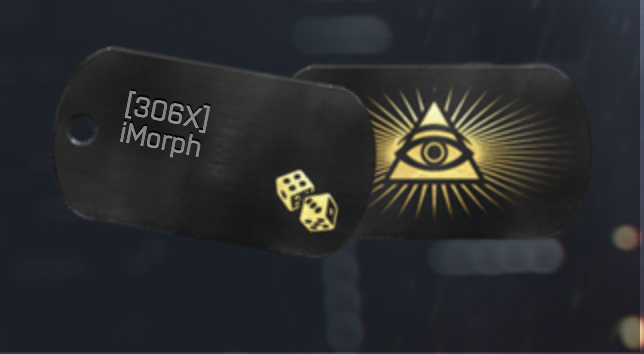

## Battlefield: Dog Tags Overview
- Battlefield 4 is a large-scale war FPS/sandbox video game.
- In BF4, players collect 'Dog Tags'. (See Image Above)
- Dog Tags are collected from enemy players.
- Players can equip Dog Tags they have collected from enemy players.
## Battlefield: Dog Tags Collection
- There are 720 collectable Dog Tags in BF4. 
- There are 288 left-side Dog Tags 
- There are 432 right-side Dog Tags.
- I have collected 368 out of the 720 collectable Dog Tags.  
- I have collected 273 out of the 288 collectable left-side Dog Tags.
- I have collected 95 out of the 431 collectable right-side Dog Tags.

### MY DOG TAG COLLECTION: 

1. LEFT-SIDE DOG TAGS 

|Category   |Collected|Collectable|
|-----------|---------|-----------|
|MISC       |1        |1          |
|Exclusive  |0        |4          |
|Ranks      |5        |5          |
|Permium    |8        |13         |
|Multiplayer|9        |15         |
|Flags      |250      |250        |
|Total      |273      |288        |

2. RIGHT-SIDE DOG TAGS  

|Category   |Collected|Collectable|
|-----------|---------|---------|
|MISC       |2        |3        |
|Kits       |7        |10       |
|Exclusive  |2        |12       |
|Service Stars|3        |12       |
|Missions   |0        |18       |
|Single Player|1        |22       |
|Permium    |22       |23       |
|Promotions |6        |25       |
|Vehicles   |0        |36       |
|Multiplayer|4        |39       |
|Medals     |9        |50       |
|Battepacks |32       |51       |
|Weapons    |7        |130      |
|Total      |95       |431      |

Link to My Battlefield Dog Tag Collection: 
- [iMorphTV's Currently Equipped Battlefield Dog Tags](https://battlelog.battlefield.com/bf4/soldier/iMorph/dogtags/779661039/32/#premium-second-assault-dog-tag)
